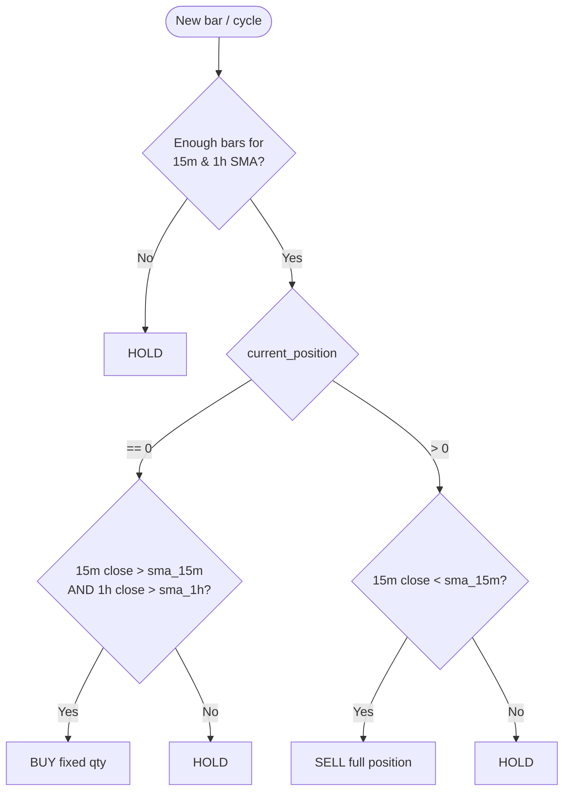
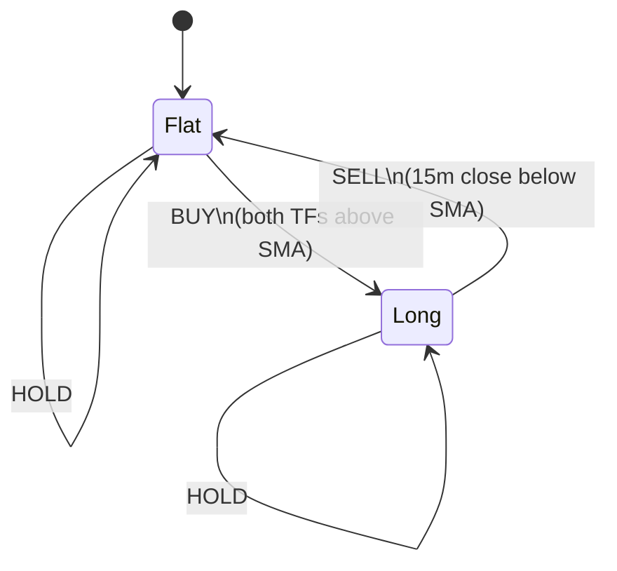
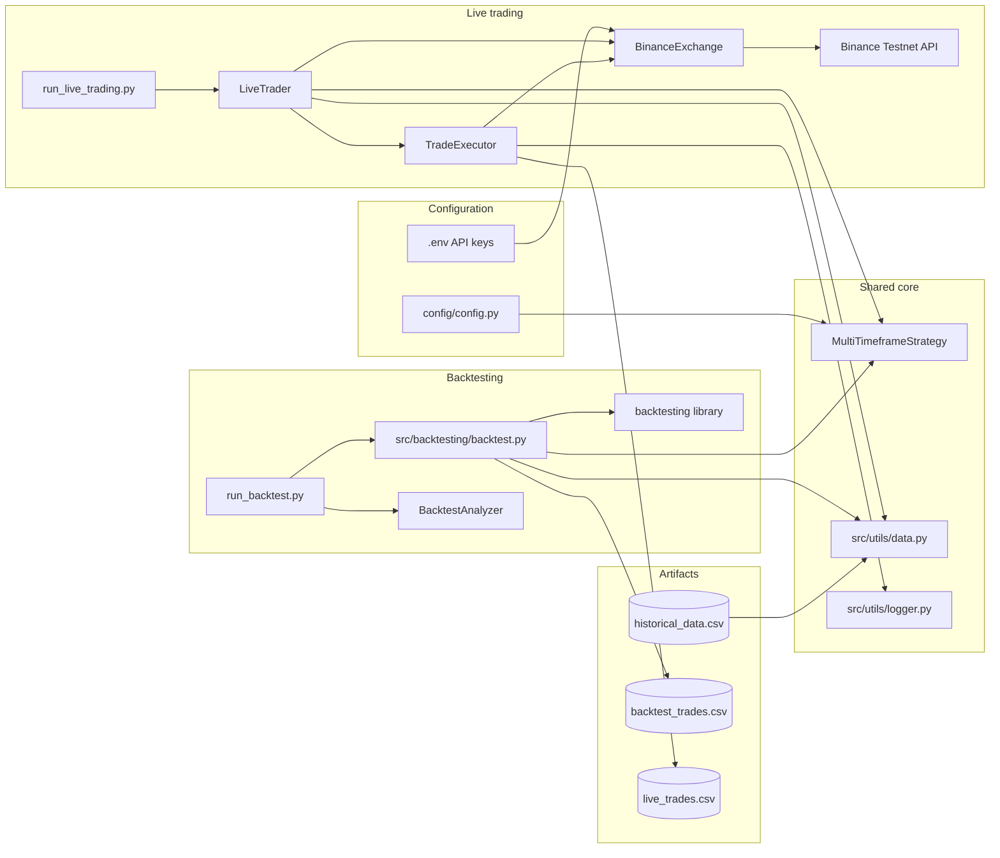
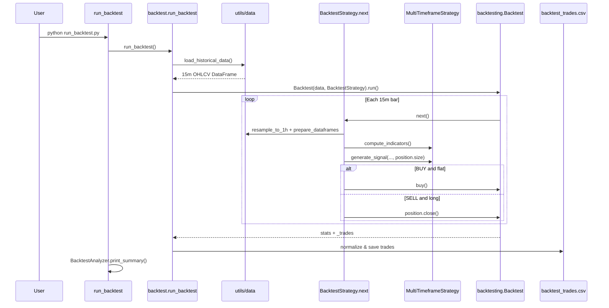
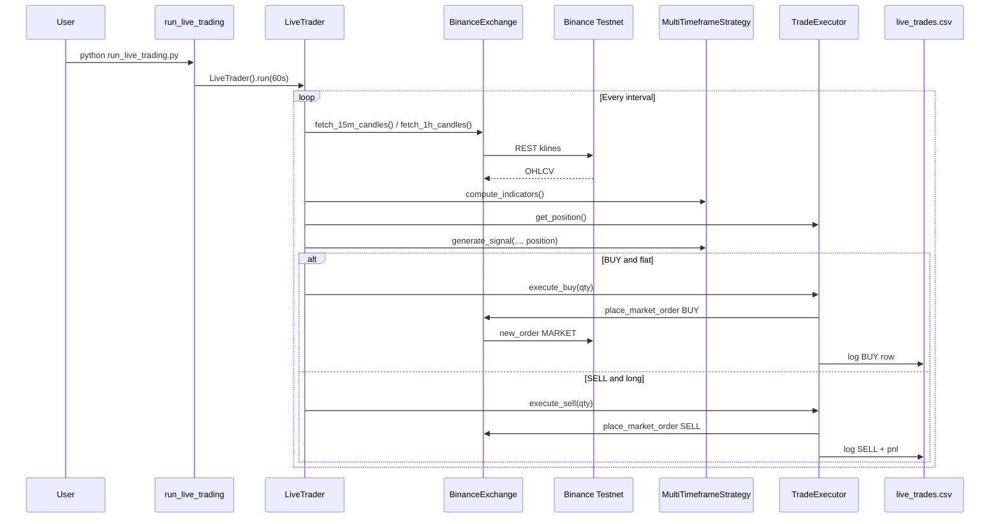
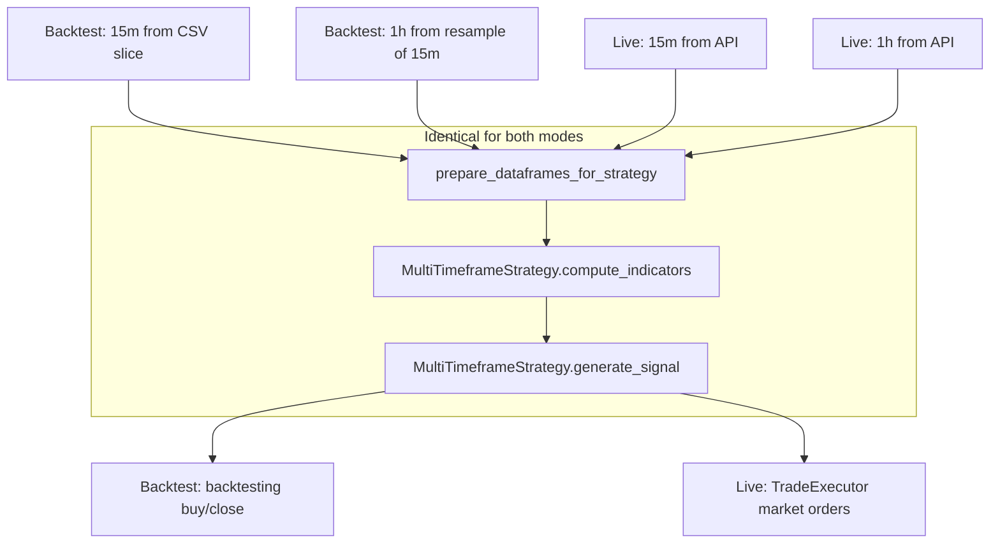

# Multi-Timeframe Trading Strategy

Personal **Python trading stack** for BTC spot: develop and replay a multi-timeframe SMA strategy on historical data, then run the same logic against **Binance Spot Testnet** with real (paper) orders. Backtest and live share one strategy module—so you iterate rules once and reuse them in both environments.

This README documents how the bot thinks (signals), how data flows (CSV vs API), and how the repo is laid out—including diagrams you can read without running anything locally.

---

## Table of Contents

1. [Executive Summary](#executive-summary)
2. [Strategy Logic (Detailed)](#strategy-logic-detailed)
3. [System Architecture](#system-architecture)
4. [Backtest Pipeline](#backtest-pipeline)
5. [Live Trading Pipeline](#live-trading-pipeline)
6. [Shared Strategy (Backtest & Live)](#shared-strategy-backtest--live)
7. [Project Structure](#project-structure)
8. [Configuration Reference](#configuration-reference)
9. [Trade Logging & Analysis](#trade-logging--analysis)
10. [How to Run](#how-to-run)
11. [Design Decisions & Assumptions](#design-decisions--assumptions)
12. [Dependencies](#dependencies)

---

## Executive Summary

| Aspect | Choice |
|--------|--------|
| **Asset** | `BTCUSDT` (Spot) |
| **Timeframes** | 15m (timing) + 1h (trend filter) |
| **Indicators** | 20-period SMA on each timeframe |
| **Direction** | Long only |
| **Position sizing** | Fixed quantity per entry (`FIXED_QUANTITY` in config) |
| **Risk controls** | One open position; no stop-loss / take-profit |
| **Live environment** | Binance Testnet only |
| **Architecture** | One `MultiTimeframeStrategy` used by backtest runner and live bot |

---

## Strategy Logic (Detailed)

### Rules

1. **Indicators**
   - `sma_15m` = rolling mean of 15m `close` over `SMA_15M_PERIOD` (default 20).
   - `sma_1h` = rolling mean of 1h `close` over `SMA_1H_PERIOD` (default 20).

2. **Entry (flat → long)**
   - Current position is **0**.
   - Latest 15m bar: `close > sma_15m`.
   - Latest 1h bar: `close > sma_1h`.
   - Signal: **`BUY`** with quantity `FIXED_QUANTITY`.

3. **Exit (long → flat)**
   - Current position is **> 0**.
   - Latest 15m bar: `close < sma_15m`.
   - Signal: **`SELL`** with quantity = full position size.
   - Note: exit uses **15m only**; 1h is not required to flip for exit.

4. **Otherwise**
   - Signal: **`HOLD`**, quantity 0.

5. **Warm-up**
   - If fewer than 20 bars on either timeframe, return `HOLD` (insufficient SMA history).

### Signal decision flow



### Position state machine



### Rationale (multi-timeframe)

- **15m** provides responsive entry/exit timing on the primary series.
- **1h** acts as a higher-timeframe filter so entries only occur when the broader trend (by SMA) agrees.
- Exits on **15m only** avoid staying in a trade after short-term momentum breaks, even if 1h still looks bullish.

Implementation: `src/strategy/multi_tf.py` (extends abstract `BaseStrategy` in `src/strategy/base.py`).

---

## System Architecture

### High-level component diagram



### Layer responsibilities

| Layer | Modules | Responsibility |
|-------|---------|----------------|
| **Strategy** | `base.py`, `multi_tf.py` | Indicators + signals; no I/O, no exchange |
| **Data** | `utils/data.py` | Load CSV history, resample 15m→1h, normalize column names |
| **Backtest** | `backtest.py`, `analyzer.py` | Wrap strategy in `backtesting` library; export & analyze trades |
| **Trading** | `exchange.py`, `executor.py`, `live_trader.py` | Fetch candles, market orders, position tracking, CSV logs |
| **Config** | `config/config.py` | Symbol, SMA periods, paths, commission, API URL |
| **Entry points** | `run_*.py`, `scripts/*` | CLI wrappers for backtest, live, data gen, comparison |

---

## Backtest Pipeline

Historical data is **15-minute OHLCV** (`data/historical_data.csv`). On each simulated 15m bar, the engine builds an aligned 1h series by resampling in-memory (same helper path conceptually as live’s native 1h feed).



**Backtest-specific notes:**

- Uses the third-party [`backtesting`](https://github.com/kernc/backtesting.py) engine for bar iteration and portfolio simulation.
- `BacktestStrategy` is a thin adapter: it owns a `MultiTimeframeStrategy` instance and delegates all decisions to it.
- Commission and initial cash come from `BACKTEST_COMMISSION` and `BACKTEST_INITIAL_CASH`.
- Completed round-trips are written to `data/backtest_trades.csv` with columns: `EntryTime`, `ExitTime`, `Symbol`, `Side`, `EntryPrice`, `ExitPrice`, `PnL`.

---

## Live Trading Pipeline

Live mode polls the exchange on a fixed interval (default **60 seconds**), fetches **native** 15m and 1h klines, runs the same strategy methods, and sends **market** orders when signals fire.



**Live-specific notes:**

- `BinanceExchange` uses `python-binance` `Spot` client pointed at `https://testnet.binance.vision`.
- `TradeExecutor` tracks local position size and average entry price; PnL is recorded on **SELL** rows.
- Fill prices come from order `fills` in the API response (real slippage vs backtest assumptions).

---

## Shared Strategy (Backtest & Live)

Both paths call the same strategy code in the same order—indicators first, then `generate_signal()`—so backtest results reflect the rules the live bot will use:



| Concern | Backtest | Live | Notes |
|---------|----------|------|--------|
| Entry/exit rules | `generate_signal()` | Same | Shared implementation |
| SMA periods | Config | Config | Shared constants |
| 1h series | Resampled from 15m history | Exchange 1h klines | Same logic; bar timestamps may differ |
| Execution | Simulated at bar close | Market orders + fills | Live has slippage and fill latency |
| Position size | Library wrapper sizing | `FIXED_QUANTITY` from config | Strategy qty is shared; backtest adapter may use library units |
| Logging | Round-trip CSV | Per-order CSV | `BacktestAnalyzer.compare_with_live()` for side-by-side stats |

When you compare logs, expect differences in timestamps, prices, and trade count; signal rules themselves are the same. Optional: `python scripts/compare_trades.py`.

---

## Project Structure

```
numatix-assignment/
├── config/
│   └── config.py              # Central constants, paths, env-loaded API keys
├── src/
│   ├── strategy/
│   │   ├── base.py            # Abstract strategy interface
│   │   └── multi_tf.py        # SMA multi-TF logic (shared brain)
│   ├── backtesting/
│   │   ├── backtest.py        # Backtesting.py adapter + run_backtest()
│   │   └── analyzer.py        # Stats + backtest vs live comparison
│   ├── trading/
│   │   ├── exchange.py        # Testnet klines + market orders
│   │   ├── executor.py        # Order execution + live CSV logging
│   │   └── live_trader.py     # Polling loop orchestration
│   └── utils/
│       ├── data.py            # CSV load, resample, column prep
│       └── logger.py          # Logging + log_trade_to_csv()
├── data/
│   ├── historical_data.csv    # Generated or supplied 15m OHLCV
│   ├── backtest_trades.csv    # Backtest output (sample may be committed)
│   └── live_trades.csv        # Live order log (sample may be committed)
├── scripts/
│   ├── generate_data.py       # Synthetic 7-day 15m series (seeded RNG)
│   └── compare_trades.py      # CLI for analyzer comparison
├── run_backtest.py            # Backtest entry point
├── run_live_trading.py        # Live bot entry point
├── requirements.txt
├── .env.example               # Template for BINANCE_API_KEY / SECRET
└── README.md
```

---

## Configuration Reference

Defined in `config/config.py` (overridable via environment for secrets):

| Setting | Default | Purpose |
|---------|---------|---------|
| `SYMBOL` | `BTCUSDT` | Trading pair |
| `SMA_15M_PERIOD` / `SMA_1H_PERIOD` | 20 | SMA lookback |
| `FIXED_QUANTITY` | 0.001 BTC | Strategy BUY size |
| `BACKTEST_INITIAL_CASH` | 1_000_000 | Starting equity in simulation |
| `BACKTEST_COMMISSION` | 0.001 | Per-trade commission rate |
| `BINANCE_TESTNET_BASE_URL` | testnet.vision | Live API base |
| `HISTORICAL_DATA_PATH` | `data/historical_data.csv` | Backtest input |
| `BACKTEST_TRADES_PATH` | `data/backtest_trades.csv` | Backtest output |
| `LIVE_TRADES_PATH` | `data/live_trades.csv` | Live output |

API keys: `BINANCE_API_KEY`, `BINANCE_API_SECRET` via `.env` (see `.env.example`).

---

## Trade Logging & Analysis

### Backtest trades (`backtest_trades.csv`)

| Column | Description |
|--------|-------------|
| `EntryTime` / `ExitTime` | Simulated round-trip timestamps |
| `Symbol` | e.g. BTCUSDT |
| `Side` | LONG |
| `EntryPrice` / `ExitPrice` | Simulated prices |
| `PnL` | Profit/loss for the round trip |

### Live trades (`live_trades.csv`)

| Column | Description |
|--------|-------------|
| `timestamp` | Unix time of execution |
| `symbol`, `side`, `price`, `quantity` | Order details |
| `entry_price` | Set on BUY; carried on SELL |
| `exit_price`, `pnl` | Populated on SELL |
| `metadata` | e.g. Binance `orderId` |

### Analysis API

- `BacktestAnalyzer.calculate_statistics()` — win rate, total/average PnL, profit factor, etc.
- `BacktestAnalyzer.print_summary()` — human-readable backtest report.
- `BacktestAnalyzer.compare_with_live()` — trade counts and aggregate PnL across modes.

---

## How to Run

```bash
pip install -r requirements.txt
python scripts/generate_data.py    # creates data/historical_data.csv
python run_backtest.py
```

Live (requires Testnet keys from [Binance Testnet](https://testnet.binance.vision/)):

```bash
cp .env.example .env   # add BINANCE_API_KEY / BINANCE_API_SECRET
python run_live_trading.py
```

---

## Design Decisions & Assumptions

- **Single strategy module** avoids duplicated entry/exit logic between simulation and production-style execution.
- **Stateless strategy** — position is passed into `generate_signal()`; live position lives in `TradeExecutor`, backtest position in the library.
- **Long-only, one position** — keeps signal state simple for a first-cut bot.
- **No stops/targets** — exit is purely rule-based on 15m SMA cross under.
- **Testnet only** — live path is for paper trading and integration testing, not mainnet production.
- **Synthetic backtest data** — `generate_data.py` produces reproducible 15m series (seed 42) when real history is not bundled.

---

## Dependencies

| Package | Role |
|---------|------|
| `pandas` | OHLCV handling, resampling, CSV I/O |
| `backtesting` | Event-driven backtest engine |
| `python-binance` | Spot REST client for Testnet |
| `python-dotenv` | Load API keys from `.env` |

---

## Summary

A long-only, dual-timeframe SMA bot on `BTCUSDT`: backtest on historical 15m CSV, trade live on Binance Testnet. **`MultiTimeframeStrategy`** holds the rules; backtest and live are thin wrappers around data fetch and order execution. CSV trade logs plus `BacktestAnalyzer` help review performance and compare simulation vs paper fills when you want to.

---

**By LOVISH JINDAL**
